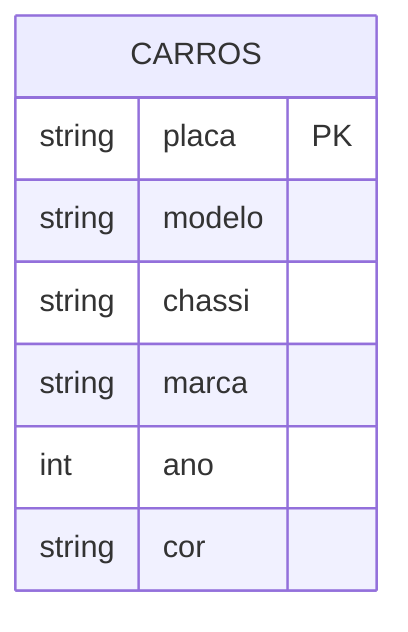

# Spark com Delta Lake e Iceberg

Trabalho de pesquisa de **Engenharia de Dados** (UNISATC), Prof. Jorge Luiz da Silva.

## Objetivo

Usar o **Apache Spark (PySpark)** para executar `INSERT`, `UPDATE` e `DELETE` em tabelas de dois formatos abertos de **Lakehouse**:

- **Delta Lake**, criado pela Databricks
- **Apache Iceberg**, criado pela Netflix

## Por que Delta e Iceberg?

Um Data Lake comum guarda arquivos Parquet sem garantias de transação. Por isso não é possível fazer `UPDATE` ou `DELETE` com segurança. Delta e Iceberg adicionam uma **camada de metadados** sobre os arquivos Parquet e passam a oferecer:

- **Transações ACID**
- `UPDATE`, `DELETE` e `MERGE`
- **Histórico de versões** e _time travel_

Essa é a base do **Data Lakehouse** (Data Warehouse + Data Lake).

## Cenário

Uma tabela, **`carros`**, com o cadastro de veículos de uma seguradora. O dataset (`data/carros.csv`) foi criado pelo grupo a partir do exemplo visto em aula.

| placa   | modelo    | chassi      | marca      | ano  | cor     |
| ------- | --------- | ----------- | ---------- | ---- | ------- |
| ALD3834 | CLIO      | 34574215969 | RENAULT    | 2011 | BRANCO  |
| CCR8096 | CRETA     | 88547875547 | HYUNDAI    | 2020 | BRANCO  |
| DLA3438 | PUNTO     | 98823483434 | FIAT       | 2013 | PRETO   |
| EEE1056 | ECO SPORT | 56753453455 | FORD       | 2020 | AZUL    |
| FFR1234 | PALIO     | 32383478747 | FIAT       | 2020 | AMARELO |
| GQY6753 | S10       | 72004160549 | GM         | 2015 | PRETO   |
| IAC8974 | TIGUAN    | 77130757746 | VOLKSWAGEN | 2020 | AZUL    |
| JIE0952 | PASSAT    | 87493270405 | VOLKSWAGEN | 2016 | CINZA   |

## Operações demonstradas

As mesmas operações são feitas em Delta e em Iceberg:

| Operação        | Comando                                            |
| --------------- | -------------------------------------------------- |
| **INSERT**      | inclui o carro `KLM2468` (ONIX, GM, 2023, PRATA)   |
| **UPDATE**      | muda a cor do ECO SPORT (`EEE1056`) para VERMELHO  |
| **DELETE**      | remove os carros com `ano < 2015` (CLIO e PUNTO)   |
| **Time travel** | consulta a tabela como estava após a carga inicial |

**Resultado final** (7 carros):

| placa       | modelo    | marca      | ano      | cor          |
| ----------- | --------- | ---------- | -------- | ------------ |
| CCR8096     | CRETA     | HYUNDAI    | 2020     | BRANCO       |
| EEE1056     | ECO SPORT | FORD       | 2020     | **VERMELHO** |
| FFR1234     | PALIO     | FIAT       | 2020     | AMARELO      |
| GQY6753     | S10       | GM         | 2015     | PRETO        |
| IAC8974     | TIGUAN    | VOLKSWAGEN | 2020     | AZUL         |
| JIE0952     | PASSAT    | VOLKSWAGEN | 2016     | CINZA        |
| **KLM2468** | **ONIX**  | **GM**     | **2023** | **PRATA**    |

## Tecnologias

Python 3.11 · Java 17 · PySpark 3.5 · Delta Lake 3.3.2 · Iceberg 1.9.2 · uv · JupyterLab · MkDocs

## Referências

- Canal [DataWay BR](https://www.youtube.com/@DataWayBR) no YouTube
- Repositório [jlsilva01/spark-delta](https://github.com/jlsilva01/spark-delta)
- Repositório [jlsilva01/spark-iceberg](https://github.com/jlsilva01/spark-iceberg)
- [Documentação do Apache Spark](https://spark.apache.org/docs/3.5.3/)
- [Documentação do Delta Lake](https://docs.delta.io/)
- [Documentação do Apache Iceberg](https://iceberg.apache.org/docs/latest/)
- [Documentação do uv](https://docs.astral.sh/uv/)
