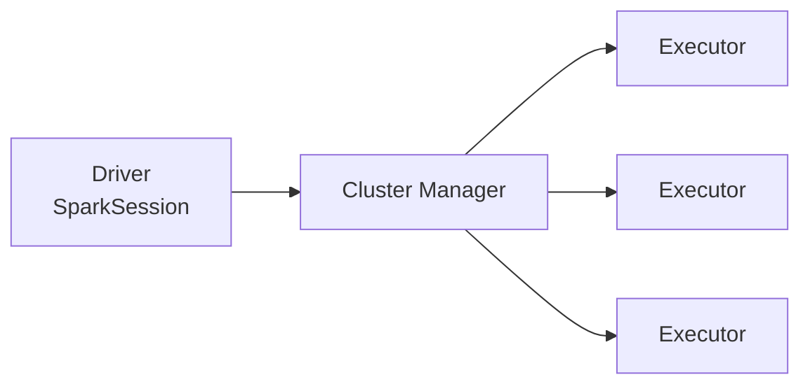

# Apache Spark (PySpark)

## O que é

O **Apache Spark** é um motor de processamento de dados **distribuído e em memória**. Foi criado em 2009 na Universidade de Berkeley e é projeto da Apache Software Foundation desde 2013. Ele processa grandes volumes de dados dividindo o trabalho entre várias máquinas, ou entre vários núcleos de uma máquina só.

O **PySpark** é a API do Spark para Python.

## Arquitetura



- **Driver:** executa o seu código e divide o trabalho em tarefas
- **Executors:** executam as tarefas em paralelo
- **Cluster Manager:** distribui os recursos (Standalone, YARN, Kubernetes)

Neste trabalho usamos o modo **`local[*]`**: driver e executors rodam no próprio computador, usando todos os núcleos.

## SparkSession

É o ponto de entrada de qualquer aplicação Spark:

```python
from pyspark.sql import SparkSession

spark = SparkSession.builder.appName("exemplo").master("local[*]").getOrCreate()

df = spark.read.csv("data/carros.csv", header=True, inferSchema=True)
df.filter(df.ano >= 2020).show()                 # API de DataFrame
spark.sql("SELECT marca, COUNT(*) FROM ...")      # ou SQL
```

## Como o Spark usa Delta e Iceberg

O Spark lê e grava Parquet de forma nativa. Para trabalhar com Delta ou Iceberg, basta configurar a SparkSession com:

| Configuração | Função |
|---|---|
| `spark.jars.packages` | baixa a biblioteca (JAR) do formato |
| `spark.sql.extensions` | habilita os comandos SQL extras (`UPDATE`, `DELETE`, `MERGE`) |
| `spark.sql.catalog.*` | define o catálogo, ou seja, onde ficam registradas as tabelas |

As configurações de cada formato estão nas páginas [Delta Lake](delta.md) e [Apache Iceberg](iceberg.md).
